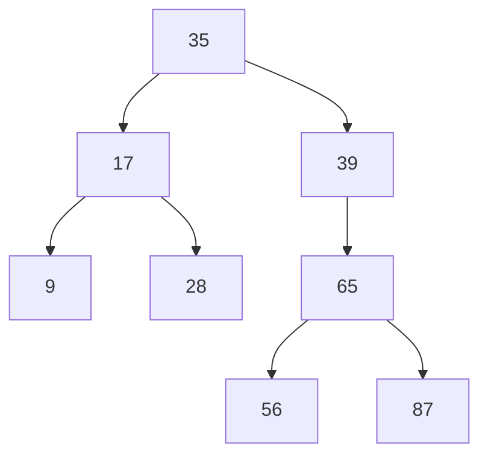

## 二叉树
核心：
1. 所有非叶子结点至多拥有两个儿子；
2. 每个结点都存有一个关键字；
3. 每个非叶子结点左指针指向小于其关键字的子树，右指针指向大于其关键字的子树；

Q：存在单边树

A：可以在原二叉搜索树上加入平衡算法，即“平衡二叉树”，如何保持B树结点分布均匀的平衡算法是平衡二叉树的关键；平衡算法是一种在二叉搜索树中插入和删除结点的策略。

[平衡二叉树]([https://baike.baidu.com/item/%E5%B9%B3%E8%A1%A1%E4%BA%8C%E5%8F%89%E6%A0%91/10421057?fr=aladdin](https://baike.baidu.com/item/平衡二叉树/10421057?fr=aladdin))：它是一 棵空树或它的左右两个子树的高度差的绝对值不超过1，并且左右两个子树都是一棵平衡二叉树。平衡二叉树的常用实现方法有[红黑树](https://baike.baidu.com/item/红黑树/2413209)、[AVL](https://baike.baidu.com/item/AVL/7543015)、[替罪羊树](https://baike.baidu.com/item/替罪羊树/13859070)、[Treap](https://baike.baidu.com/item/Treap)、[伸展树](https://baike.baidu.com/item/伸展树/7003945)等

二叉查找树（Binary Search Tree），平衡二叉查找树（Balanced Binary Search Tree），[红黑树](http://blog.csdn.net/v_JULY_v/category/774945.aspx)(Red-Black Tree )是典型的二叉查找树结构，其查找的时间复杂度*O*(log2*N*)与树的深度相关，那么降低树的深度自然会提高查找效率

平衡二叉树，红黑树即为平衡二叉树的一种。

**额外补充：二叉树的遍历分为以下三种**

先序遍历：遍历顺序规则为【根左右】
中序遍历：遍历顺序规则为【左根右】
后序遍历：遍历顺序规则为【左右根】

## 红黑树

（1）每个节点要么是黑色，要么是红色。（节点非黑即红）
（2）根节点是黑色。
（3）每个叶子节点（NIL）是黑色。 
（4）如果一个节点是红色的，则它的子节点必须是黑色的。（也就是说父子节点不能同时为红色）
（5）从一个节点到该节点的子孙节点的所有路径上包含相同数目的黑节点。（这一点是平衡的关键）

Q：二叉查找树结构由于**树的深度过大而造成磁盘I/O读写过于频繁，进而导致查询效率低下**

A：一个基本的想法就是，采用**多叉树**结构（由于树节点元素数量是有限的，自然该节点的子树数量也就是有限的）。

## B树即B-tree(B-树、多路平衡查找树)

B 树是为了磁盘或其它存储设备而设计的一种多叉（相对于二叉，B树每个内结点有多个分支，即多叉）平衡查找树

一棵m阶B树(balanced tree of order m)是一棵平衡的m路搜索树。它或者是空树，或者是满足下列性质的树：

1、根结点至少有两个子女；

2、每个非根节点所包含的关键字个数 j 满足：┌m/2┐ - 1 <= j <= m - 1；

3、除根结点以外的所有结点（不包括叶子结点）的度数正好是关键字总数加1，故**内部子树**个数 k 满足：┌m/2┐ <= k <= m ；

4、所有的叶子结点都位于同一层。

## B+树

**B+-tree**：是应文件系统所需而产生的一种B-tree的变形树

**所有的非终端结点可以看成是索引部分**，结点中仅含有其子树根结点中最大（或最小）关键字。 (而B 树的非终节点也包含需要查找的有效信息)

## B*树

B*树中非根和非叶子结点再增加指向兄弟的指针；B*树定义了非叶子结点关键字个数至少为(2/3)*M，即块的最低使用率为2/3（代替B+树的1/2）

参考：[从B树、B+树、B*树谈到R 树](https://blog.csdn.net/v_JULY_v/article/details/6530142/)