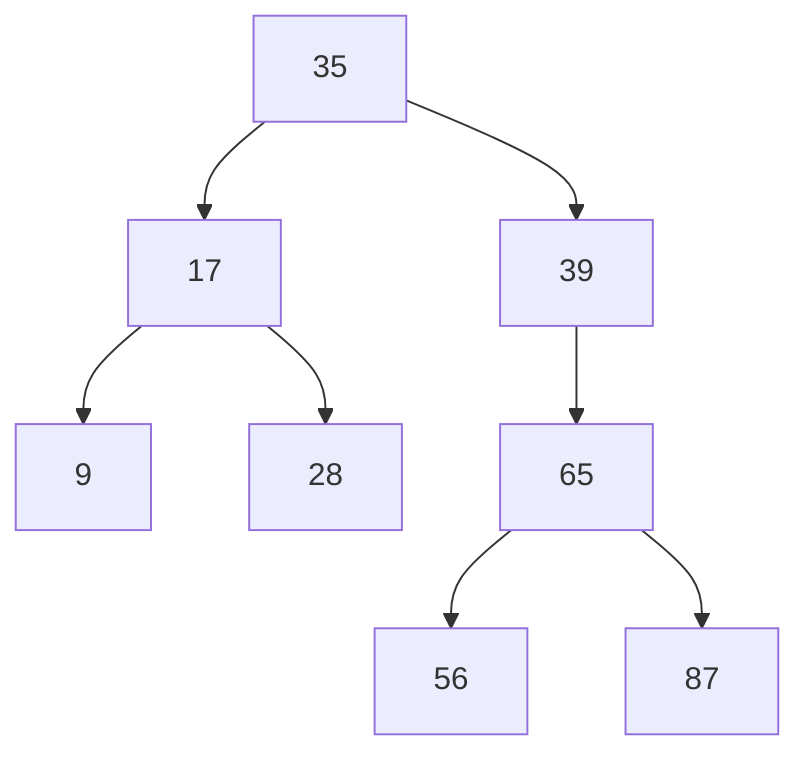

## 二叉搜索树

核心：

1. 所有非叶子结点至多拥有两个儿子；

2. 每个结点都存有一个关键字；

3. 每个非叶子结点左指针指向小于其关键字的子树，右指针指向大于其关键字的子树；

Q：存在单边树

A：可以在原二叉搜索树上加入平衡算法，即“平衡二叉树”，如何保持B树结点分布均匀的平衡算法是平衡二叉树的关键；平衡算法是一种在二叉搜索树中插入和删除结点的策略。

[平衡二叉树]([https://baike.baidu.com/item/%E5%B9%B3%E8%A1%A1%E4%BA%8C%E5%8F%89%E6%A0%91/10421057?fr=aladdin](https://baike.baidu.com/item/平衡二叉树/10421057?fr=aladdin))：它是一 棵空树或它的左右两个子树的高度差的绝对值不超过1，并且左右两个子树都是一棵平衡二叉树。平衡二叉树的常用实现方法有[红黑树](https://baike.baidu.com/item/红黑树/2413209)、[AVL](https://baike.baidu.com/item/AVL/7543015)、[替罪羊树](https://baike.baidu.com/item/替罪羊树/13859070)、[Treap](https://baike.baidu.com/item/Treap)、[伸展树](https://baike.baidu.com/item/伸展树/7003945)等

Q：二叉查找树结构由于**树的深度过大而造成磁盘I/O读写过于频繁，进而导致查询效率低下**

A：一个基本的想法就是，采用**多叉树**结构（由于树节点元素数量是有限的，自然该节点的子树数量也就是有限的）。

## B树即B-tree(B-树、多路平衡查找树)

B 树是为了磁盘或其它存储设备而设计的一种多叉（相对于二叉，B树每个内结点有多个分支，即多叉）平衡查找树

## B+树

## 红黑树

参考：[从B树、B+树、B*树谈到R 树](https://blog.csdn.net/v_JULY_v/article/details/6530142/)