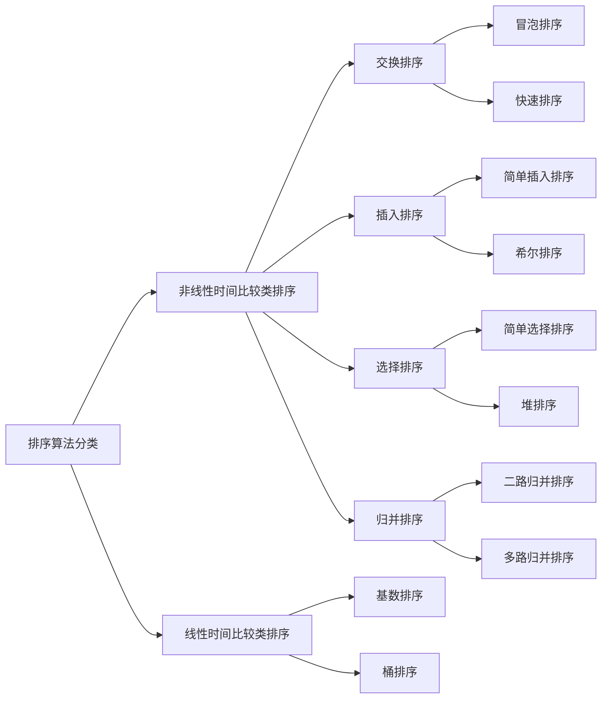

# 排序算法

PS：在整理过程中发现了一个不错的开源文章[《十大经典排序算法》](https://github.com/hustcc/JS-Sorting-Algorithm)

## 简介

算法复杂度分为时间复杂度和空间复杂度。

时间复杂度是指执行这个算法所需要的计算工作量

空间复杂度是指执行这个算法锁需要的资源



假设有k个元素，n为当前坐标，f(n) 为当前坐标值。

## 冒泡排序
- 核心

  用``f(n)`` 和 ``f(n+1)``比较，如果大于则交换，小于则不变。然后``n+1``继续比较，一轮下来，则最后的一个值为最大值。然后从``n=0``重新开始，一直到``K-当前轮数``。共需要``k-1``轮，总共比较次数为``k*(k-1)/2``

- 优化

  第一次交换之前的 和 最后一次交换之后的都是有序的，so修改每次比较的开始坐标和结束坐标可优化程序。


## 快速排序

- 核心

  通过一趟排序将要排序的数据分割成独立的两部分，其中一部分的所有数据都比另外一部分的所有数据都要小，然后再按此方法对这两部分数据分别进行快速排序，整个排序过程可以递归进行，以此达到整个数据变成有序序列。

- 优化
  
  - 三平均分区法：取最左边、最右边、中间坐标的值比较，取中间值做中轴。（三值也可以是三块区域的中间值，比较好的避免了最坏的情况）
  
  - 根据分区大小调整算法：递归达到一定深度时就改为堆排序来处理
  
  - 并行的快速排序：如果分区的元素数目多于该阀值的话，就创建一个新的线程来处理这个分区的排序
  
    
  


## 插入排序
1. *插入排序的**基本方法**是：每步将一个待排序的元素，按其排序码大小插入到前面已经排好序的一组元素的适当位置上去，直到元素全部插入为止*
2. 可以选择不同的方法在已经排好序的有序数据表中寻找插入位置，依据查找方法的不同，有多种插入排序方法。下面是常用的三种。 
a 直接插入排序 
b 折半插入排序 
c 希尔排序 
### 直接插入排序

- 核心
  是指将无序序列中的各元素依次插入到已经有序的线性表中。
  一般来说，假设线性中前j－1元素已经有序，现在要将线性表中第j个元素插入到前面的有序子表中，插入过程如下：
当插入第i（i>1）个元素时，前面的data[0],data[1]……data[i-1]已经排好序。这时用data[i]的排序码与data[i-1],data[i-2],……的排序码顺序进行比较，找到插入位置即将data[i]插入，原来位置上的元素向后顺序移动。

``5`` | ``1`` ``7`` `` 3`` `` 1`` ``6``
``1`` ``5``|``7`` ``3`` ``1`` ``6`` 
``1`` ``5`` ``7``|``3`` ``1`` ``6`` 
... 
``1`` ``1`` ``3`` ``5`` ``6`` ``7`` |

  ### 折半插入排序

  和直接插入排序类似，只是插入的时候采用**折半（二分）搜索法**寻找data[i]的插入位置。

### 希尔排序
平均时间复杂度：O(n1.3)O(n1.3) 
空间复杂度：O(1)

- 核心
希尔排序是插入排序的一种更高效的改进版本

设待排序元素序列有n个元素，首先取一个整数increment（小于n）作为间隔将全部元素分为increment个子序列，所有距离为increment的元素放在同一个子序列中，在每一个子序列中分别实行直接插入排序。然后缩小间隔increment，重复上述子序列划分和排序工作。直到最后取increment=1，将所有元素放在同一个子序列中排序为止

其中关于increment的取值
```
 第一次：increment=n/3向下取整 + 1
 之后：increment=increment/3向下取整 + 1
```

``21`` ``25`` ``49`` ``25*`` ``16`` ``08`` (25与25*相同，这里标记便于区分，表明其不稳定性)

**第一步**

increment = 6/3 +1 =3

子序列1=``21`` ``-`` ``-`` ``25*`` ``-`` ``-``  插入排序，无需交换

子序列2=``-`` ``25`` ``-`` ``-`` ``16`` ``-``  插入排序，需交换

子序列3=``-`` ``-`` ``49`` ``-`` ``-``  ``08``  插入排序，需交换

三个子序列各自插入排序，合并之后

``21`` ``16`` ``08`` ``25*`` ``25`` ``49``

**第二步**

increment  = increment /3+1=3/3+1=2

子序列1=``21`` ``-`` ``08`` ``-`` ``25`` ``-``  插入排序，需交换

子序列2=``-`` ``16`` ``-`` ``25*`` ``-`` ``49``  插入排序，无需交换

三个子序列各自插入排序，合并之后

``08`` ``16`` ``21`` ``25*`` ``25`` ``49``

**第三步**

increment  = increment /3+1=1/3+1=1

当增量为1的时候，实际上就是把整个数列作为一个子序列进行插入排序。

## 简单选择排序

- 核心
假設所需排序的序列中[0,k]，選取最小的值與第一位交換，再從[1,k]中選取最小的值與第二位交換，以此類推，直到排序完成。（由於交換，出現不穩定，如[5 8 5 2 9]）


## 堆排序
最大堆调整（Max Heapify）：将堆的末端子节点作调整，使得子节点永远小于父节点
创建最大堆（Build Max Heap）：将堆中的所有数据重新排序
堆排序（HeapSort）：移除位在第一个数据的根节点，并做最大堆调整的递归运算 [1] 


## 二路归并排序
归并排序（MERGE-SORT）是建立在归并操作上的一种有效的排序算法,该算法是采用分治法（Divide and Conquer）的一个非常典型的应用。将已有序的子序列合并，得到完全有序的序列；即先使每个子序列有序，再使子序列段间有序。若将两个有序表合并成一个有序表，称为二路归并。


## 多路归并排序


## 基数排序

- 核心

基数排序是一种非比较型整数排序算法，其原理是将整数按位数切割成不同的数字，然后按每个位数分别比较。由于整数也可以表达字符串（比如名字或日期）和特定格式的浮点数，所以基数排序也不是只能使用于整数。

LSD(从低位开始) 基数排序演示
**原始：**``21`` ``25`` ``49`` ``25*`` ``16`` ``08``

第一次分桶（按个位数）
0（）、1（21）、2（）、3（）、4（）、5（25，25*）、6（16）、7（）、8（08）、9（49）

**合并后：** ``21`` ``25`` ``49`` ``25*`` ``16`` ``08``

第二次次分桶（按十位数）
0（08）、1（16）、2（21，25，25*）、3（）、4（49）、5（）、6（）、7（）、8（）、9（）
**合并后：**``08`` ``16`` ``21`` ``25`` ``25*`` ``49`` 


## 桶排序

- 核心

设一个定量的空桶，
遍历序列，将元素放入到对应的桶中，非空桶的内部自行排序（一般用快排），
将非空桶的元素按序取出填入原序列中。

通常情况下，上下界有两种取法，第一种是取一个10^n或者是2^n的数，方便实现。另一种是取数列的最大值和最小值然后均分作桶

